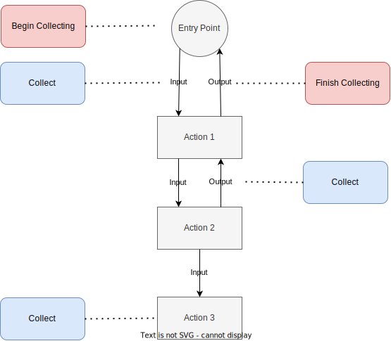
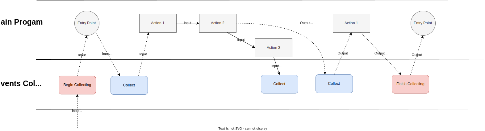
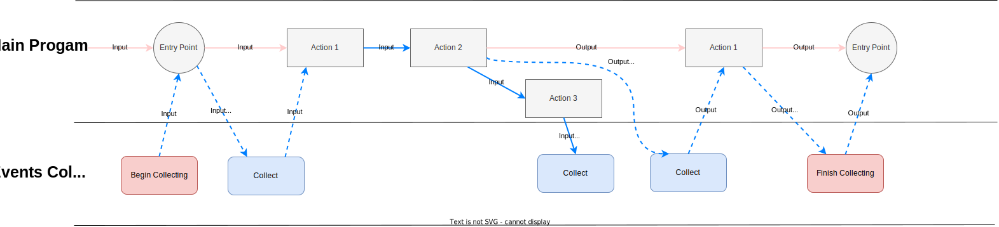

# Rozsa Events Collector

The aim of this project is to provide a library to be used in capturing data from the program execution flow. The captured data is then published as an event to a configurable destination.

To avoid cluttering the business code with observability related functionalities, the library provides an annotation based approach for marking methods, parameters and fields for collection without any further changes in the main algorithm (although if desired is possible to collect data by calling directly the collector).

## Terms

- Data - a single element that means something for the specific flow in observation
- Event - a composition of many pieces of data that have a depper meaning when groupped together.
- Collect - the action of storing data from an execution flow
- Submit - the action of generating and submitting an event to a remote server

## Collection Approaches

- Via annotation
- Via direct call

## Collected Data

- Primitive types
- Objects fields
- Via getters (?)

## Actions

- Begin Collecting
- Collect
- Finish Collecting (submit event)

## Custom Behaviors

- Bean for overwriting submit action (default action is a HTTP post)
- Bean for allowing custom code to retrieve data from a collectable object
- Modifying default submit config (url, headers)
- Modifying default event ID generator

## Non-functional Features

- Thread-independent
- Cache-heavy for reflection-based operations
- Pre-process annotation at startup to cache reflective operations

## Functional Features

- Send events to remote server
- Allows batching events to reduce submit overhead (desired)
- Auto-generate IDs for events

## Diagrams

### Basic Flowchart

### Lane Flowcharts

**Real flow**

- Blue arrows represents the underlying execution flow, by using proxies to run advices.

**Visible flow**

- Pink arrows represents the visible flow from the coding view point, as if there is no extra code besides the project code.

### Class Diagram

### Classes

**EventsCollectorManager**
- Core component that holds orchestration logic
- Can be used directly to control collection and submission, by including it as a dependency in the code
- Includes a ThreadLocal to hold thread-specific context data

**HttpEventsSubmitter**
- HTTP based approach to submit events to remote server
- Uses java-native HTTPClient to post event data as a map of values in JSON format

**UuidEventsIdGenerator**
- Generate UUID identifiers for events

**EventsCollectorConfiguration**
- Allows the library user to customize the library default behavior

### Interfaces

**ObjectCollector**
- Custom implementation for parsing a collectable object.
- Define a name for the collector
- Provide this implementation as a bean

**CollectionSubmitter**

- Custom implementation for submitting data to target server
- Provide this implementation to override default submitter implementation

**EventIdGenerator**

- Custom implementation for generating IDs for events
- Provide this implementation to override default ID generation algorithm

### Annotations

**BeginCollecting**
- Generates an ID for current collection
- Clears the cache to ensure clean collection
- Can't be used to collect from annotated method. One should use Collect annotation for this purpose
- Allows to customize if the event will be submitted even if an exception is thrown (default: true).

**FinishCollecting**
- Sends collected data to target server
- Clears the cache to ensure clean collection
- Collects even if an exception is thrown (configurable)

**Collect**
- Marks a method for collection

**CollectParam**
- Marks a parameter for collection
- Allows to scan its fields for collection
- Allows to declare a key to save the data
- Won't use param name by default to avoid coupling the collectable with the variable name
- Allows to define a bean to extract the data to be saved

**CollectField**
- Marks a field for collection
- Allows to scan its fields for collection
- Allows to declare a key to save the data
- Won't use param name by default to avoid coupling the collectable with the variable name
- Allows to define a bean to extract the data to be saved

### Configurations

**EventsSubmitter**
- **endpoint** - target server
- **headers** - custom headers to be added into the submitter POST requests (default: none)

**EventsCollectorManager**
- **idFieldKey** - allows to override default ID field key (default: "id")

## TODO

- Allow to setup multiple flows from annotations
- Allow collector on CollectReturn
- Allow to setup multiple flows based on config
- Capture on records
- Create performance tests
- Add reflection caching
- Create a sample web application
- Add CI to project.