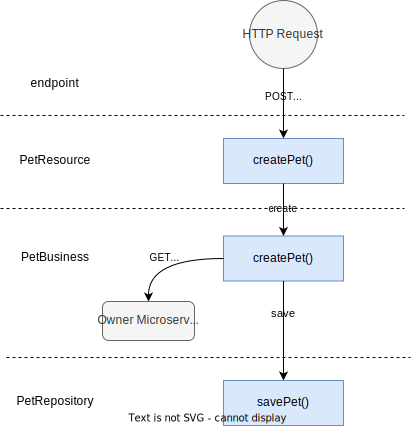
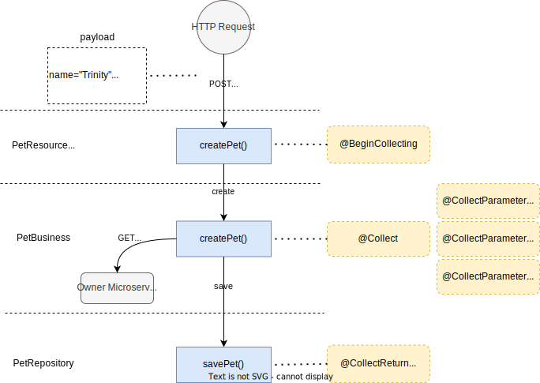

# Rozsa Events Collector

Rozsa Events Collector is a **spring-based java library** that easies the **collection** and **transmission** of events in execution flows.

The basic usage of this library is just to mark target elements for collection in an execution flow. When this flow is called then the
expected data will be collected and submitted to a remove server of choice as a map o objects. The submission behavior
may be replaced by your custom logic if necessary.

To avoid cluttering the business code with observability related functionalities, the library provides an annotation
based approach for marking methods, parameters and fields for collection without any further changes in the main
algorithm. Although if desired, it is possible to collect data by explicitly calling the collector.


## Terms

- **Data** - a single element that means something for the specific flow in observation
- **Event** - a composition of many pieces of data that have a deeper meaning when grouped together
- **Collect** - the action of storing data from an execution flow
- **Submit** - the action of generating an event from collected data and submitting it to a remote server

## Features

- Easily **start**, **collect** and **finish** the collection of data by using the `EventsCollectorManager`
- Keep observability operations out of business code by using **Annotations**
- Control collection behavior via **configuration** or by bean **overriding**
- Start using the library by just adding it to the project due to its **auto-configuration**
- Allows to define and collect from **multiple flows**


## Example

To illustrate the usage of this library, we have the following example flow:



The flowchart above represents the "pet creation flow". In this flow we have the following:

- We receive a HTTP POST request in the `/pet` endpoint with a request body;
- The `PetResource` layer receives this request, deserialize it and forward the payload to the business layer;
- The `PetBusiness` layer then receives the target payload and makes a call to the `Owner Microservice` to verify if the pet has an owner and get its data (after all, if it is a pet it has to have an owner);
- Then the `PetRepository` layer is called to persist the new pet in the database.

Now, if we want to collect some information about our request for observability purposes, we could apply the collection features
as follows:



In the illustration above, what we did was to create a "collection flow" by using the collection annotations:

- The `@BeginCollection` annotation tells that this is the starting and ending point of the collection flow
- The `@Collect`, `@CollectParameter` and `@CollectReturn` annotations tells what data has to be collected.

When the flows exemplified above finishes, we would have the following event data:
```json
{
  "petName": "Trinity",
  "petType": "CAT",
  "channel": "android",
  "petId": 123,
  "id": "e72f0041-ffb7-4f9d-9357-455249615c08"
}
```

*Note: the `id` field is a unique identifier for the event auto-generated by the library.*

This is a very simple example and the collected data could be retrieved directly from the database. But there may be many complex flows with temporary data that is not persisted on the database and would benefit from this custom collection approach.

Another common usage would be for collecting data for events that are not persisted in the database. For instance, in the pet creation example the owner is queried by its `id` and a `channel` parameters. If the owner is not found, the pet will not be created, and a failure will be returned. But all data until the failure will be collected and made available for analysing the error anyway.

This could even be handled with logs, but for high throughput or very complex cases, by having this event data we are be able to do some statical analysis that would not be as easy (or not even feasible) to do with logs.

The guideline is if you are trying to achieve some observability capabilities, you should first check some market tools like New Relic, Splunk, Datadog, Kibana, etc. If these tools don't do what you need as easy as this library, then this may be your choice.


## How To

Its is possible to collect data by accessing the `EventsCollectorManager` directly in your code or via collection `Annotations`.

### Collection Annotations

The following annotations are available:

- `@BeginCollecting` - Must be used to mark the start of a collection flow. The collection flow will automatically finish
- when the starting method returns
- `@Collect` - Mark a method for collection of its parameters
- `@CollectParameter` - Collect data from a parameter (only parameters marked with this annotation will be collected)
- `@CollectField` - Collect data from a field from an object
- `@CollectReturn` - Collect data from the return value from a method
- `@FinishCollecting` - May be used to finish a collection flow earlier (thus, this is optional)


### @BeginCollecting

`scope: method`

This annotation is mandatory to start a collection flow. If the flow isn't started, no data will be collected even if
other annotations were used.

```Java
    @BeginCollecting
    public ResponseEntity<PetResponse> getPetByName(String name) {
        ...
    }
```

#### Options

- `flow` -  defines the flow name, so it won't collide with any other collection flows. It also allows to define custom flow
configuration. This is optional but recommended.
- `submitOnError` - allows to submit event data even if the method returns with an exception (default: true)
```Java
    @BeginCollecting(flow = "xpto-flow-name", submitOnError = false)
```

### @Collect

`scope: method`

Use to inform that a method has parameters to be collected. Only methods marked with `@Collect` will be scanned for collection.

```java
    @Collect
    ResponseEntity<OwnerResponse> getOwner(Long id) {
        ...
    }
```

#### Options

- `flow` -  if defined, it will be used as the collection flow when collecting parameters (unless the CollectParameter itself defines its flow).
```java
    @Collect(flow = "foo-bar")
```

### @CollectParameter

`scope: parameter`

Defines that a parameter has to be collected. It will be read only if the target method is annotated with `@Collect`. The
collection will automatically finish when returning from the method marked with this annotation. It's possible to finish
earlier by using the [@FinishCollecting](#finishcollecting) annotation.
```java
    @Collect
    public Optional<Pet> getByName(
            @CollectParameter("petName") final String name
        ) {
        ...
    }
```

The `@CollectParameter` may receive an optional string that will be used as the key of this parameter. If no key is specified,
the parameter variable name will be used as key.

*Specifying a key is _optional_ but **recommended** as good practice (anyone may change the variable name for any reason,
but changing the key name is harder to pass by a core review).

#### Options

- `flow` - if defined, it will be used as the collection flow. If not defined, will use the flow defined by `@Collect` or
`default`
- `key` - string to be used as the collection key
- `collector` - if this is a complex object, it's possible to define the name of custom bean to do the collection logic. Check
the [Custom Collector](#custom-collector) section for how to define a custom collector
- `scanFields` - Instead of using the own parameter as the collect value, look for a field from this parameter marked with `@CollectField`.
Won't take effect if defined within a custom collector.

Configure to `scanFields` from target parameter.
```java
    @Collect
    public Optional<Pet> findPetByFilters(
            @CollectParameter(scanFields = true) final PetFilter filter
        ) {
        ...
    }
```

Overrides `@Collect` defined flow.
```java
    @Collect(flow = "xpto")
    public Optional<Pet> getByName(
        @CollectParameter(flow = "pet_flow", key = "petName") final String name
    ) {
    ...
    }
```

Defines a custom `collector`.
```java
    @Collect
    public Optional<Pet> findPetByFilters(
            @CollectParameter(collector = 'pet_filter_collector') final PetFilter filter
        ) {
        ...
    }
```

### @CollectField

`scope: field`

When using `scanFields` in a `@CollectParameter`, use `@CollectField` to mark fields from an object to be collected. Only
fields marked with this annotation will be collected.

```java
public class Owner {
    private Long id;

    @CollectField("owner_name")
    private String name;

    @CollectField("owner_age")
    private Integer age;

    private Gender gender;
}
```

#### Options

- `flow` - if defined, it will be used as the collection flow. If not defined, will use the flow defined by `@CollectParameter` or
`@Collect` annotations
- `key` - string to be used as the collection key
- `scanFields` - Instead of using the own parameter as the collect value, look for a field from this parameter marked with `@CollectField`.
Won't take effect if defined within a custom collector.

```java
public class Owner {
    @CollectField(flow = "xpto-flow", scanFields = true)
    private Pet favouritePet;
}
```

### @CollectReturn

`scope: method`

Use this annotation to collect data from the returning object from a method.
```java
    @CollectReturn("pet_id")
    public Long createPet(PetRequest petRequest) {
        ...
        }
```

It automatically unwraps the value if using `Optional<?>` before collecting. So, this is also valid.
```java
    @CollectReturn("pet_id")
    public Optional<Long> createPet(PetRequest petRequest) {
        ...
        }
```

#### Options

- `flow` - collection flow.
- `key` - string to be used as the collection key
- `collector` - if this is a complex object, it's possible to define the name of custom bean to do the collection logic. Check
  the [Custom Collector](#custom-collector) section for how to define a custom collector
- `scanFields` - Instead of using the own parameter as the collect value, look for a field from this parameter marked with `@CollectField`.
  Won't take effect if defined within a custom collector.

```java
    @CollectReturn(flow = PET_FLOW, collector = "pet_response_entity_collector")
    public ResponseEntity<PetResponse> findPetByFilter(String name, String color, Integer age, PetType type) {
        ...
        }
```

*`@CollectReturn` only auto-unwrapp from `Optional<?>` type. No other wrapper types are auto-handled right now. In this cases it is
recommended to use a [Custom Collector](#custom-collector).

### @FinishCollecting

`scope: method`

Use this annotation to finish a collection flow earlier. It will end the flow and submit event data after returning from
a method marked by this annotation.

```java
    @FinishCollecting(flow = "xpto")
    public Long create(final Pet pet) {
        ...
    }
```
#### Options

- `flow` - collection flow to be finished earlier.

### Collect via EventsCollectorManager

The `EventsCollectorManager` is the brain of the collection process and the annotations are a AOP-based layer that abstracts the usage
and inclusion of this manager directly on your code.

If you need to collect event data 'by hand' you can use inject the `EventsCollectorManager` in your code and use the following:

- `begin(String flow)` - initialize a collection flow
- `clear(String flow)` - clear all data from a collection flow (also ends the flow)
- `collect(String flow, String key, Object value)` - collect data
- `submit(String flow)` - submit data from a flow (also ends the flow)
- `getCollection(String flow)` - get data collected from a flow


## Custom Collector

Custom collectors are a way to define a customized logic to collect data. It can be used to handle complex objects or
transformations that can't be collected by simply using the `scanFields` and `@CollectiField` features.

To implement a custom collector, your have to provide a bean that implements a [ObjectCollector](/lib/src/main/java/com/rozsa/events/collector/api/ObjectCollector.java).
The bean receives the collection `flow`, `source` object for collection and the `EventsCollectorManager` so the collection
takes place. See the [Collect via EventsCollectorManager](#collect-via-eventscollectormanager) section for information about
using the manager for data collection.

The example code bellow defines a custom collector that is able to handle a `ResponseEntity<PetResponse>` and collect data from it.
```java
    @Bean("pet_response_entity_collector")
    public ObjectCollector petResponseCollector() {
        return (String flow, Object source, EventsCollectorManager eventsCollectorManager) -> {
            if (source instanceof ResponseEntity<?> target) {
                if (target.getStatusCode() != HttpStatus.OK) {
                    return;
                }

                if (target.getBody() instanceof PetResponse petResponse) {
                    eventsCollectorManager.collect(flow, PetFilterFlowKeys.RESPONSE_NAME, petResponse.getName());
                }
            }
        };
    }
```

*You may include and use any other beans to help in the collection and collection as many data from the source object as needed.

To use the custom collector, just set the collector bean name in the annotations that allows the `collector`. For instance,
```java
    @CollectReturn(flow = "pet_response_flow", collector = "pet_response_entity_collector")
    public ResponseEntity<PetResponse> findPetByFilter(String name, String color, Integer age, PetType type) {
        ...
        }
```

## Events ID Generator

When using `@BeginCollecting` to start a flow, an ID is auto-generated and added to the event data. The Events ID Generator
is responsible for doing that.

The default implementation of this component provides a `UUID` by using the java package `java.util.UUID.randomUUID`. This way,
the default auto-generated key implementation will provide an ID entry in the following format:

`{ "id": "e72f0041-ffb7-4f9d-9357-455249615c08" }`

The Events ID Generator may be overridden by providing a bean of type [EventsIdGenerator](/lib/src/main/java/com/rozsa/events/collector/api/EventsIdGenerator.java).


## Events Submitter

The events submission is the final part of the collection process. The Events Submitter is the component in charge of packing and
asynchronously submitting the collected event data to the remote server.

The default implementation of the Events Submitter is an HTTP submitter that packs the event data and `POST` it as a JSON
body to the remoter server in the following format:

````http request
POST /collect HTTP/1.1
Host: localhost:8090
User-Agent: Java-http-client/17.0.7
Content-Type: application/json
x-flow: pet_description
Content-Length: 99

[{
	"event_id": "e72f0041-ffb7-4f9d-9357-455249615c08",
	"pet_name": "Tri",
	"pet_color": "Yellow"
}]
````

This library provided events submitter, the [HttpEventsSubmitter](/lib/src/main/java/com/rozsa/events/collector/HttpEventsSubmitter.java), is more an example implementation than a productive feature. Currently, it lacks some features for high throughput flows like grouping messages before submitting (coalescing) and a retry mechanism. 

The Events Submitter may be overridden by providing a bean of type [EventsSubmitter](/lib/src/main/java/com/rozsa/events/collector/api/EventsSubmitter.java).

*You may refer to the [demo-server collection endpoint](/demo-server/src/main/java/com/rozsa/demoserver/resources/CollectorResource.java)  example to see how the events may be received in the remove server.

## Configurations

Configurations allows to customize the collection behavior for each flow/type of event you want to observe. The following
may be configured via `application.yml` or `application.properties`.

- `submit-endpoint` - the endpoint of the remote serve in which events will be posted (default: `http://localhost:8080/collect`)
- `event-id-key` - the key name for the auto-generated id in the events (default: `id`)
- `event-flow-header` - the name of the auto-inserted header with the event flow name  (default: `x-flow`)

The library `general` configuration is defined inside the `rozsa.events-collector` hierarchy:

```yml
rozsa:
  events-collector:
    submit-endpoint: 'http://localhost:8080/collect'
    event-id-key: 'custom-id'
    event-flow-header: 'x-flow-custom'
```

You may also define the same configuration above for each one of your custom flows. To do that, define a field named `flows`,
the custom flow name and its properties, as follows:

```yml
rozsa:
  events-collector:
    submit-endpoint: 'http://localhost:${wiremock.server.port}/collect'
    event-id-key: 'custom-id'
    event-flow-header: 'x-flow-custom'
    flows:
      flowAStar:
        submit-endpoint: 'http://localhost:${wiremock.server.port}/collect/flow-a'
        event-id-key: 'flow_a_key'
        event-flow-header: 'x-events-collection'
      flowB:
        submit-endpoint: 'http://localhost:${wiremock.server.port}/collect/flow-b'
```

When defining custom flows configuration, the logic to follow is that you are overriding the general configuration. Thus,
if a field is not defined in the custom flow configuration, the general configuration will be used as fallback. For example:

```yml
rozsa:
  events-collector:
    submit-endpoint: 'http://localhost:${wiremock.server.port}/collect'
    event-id-key: 'custom-id'
    event-flow-header: 'x-flow-custom'
    flows:
      flowB:
        submit-endpoint: 'http://localhost:${wiremock.server.port}/collect/flow-b'
```

We have defined a custom flow named `flowB` that defines only the `submit-endpoint`. This way, the `event-id-key` and `event-header`
values will fall back to the general configuration values `custom-id` and `x-flow-custom` respectively. If no general configuration is
defined, the default configuration will be used (`id` and `x-flow`).

# Library Development

## Modules

- **lib** [rozsa-events-collector-starter] - main module with library source code
- **demo-app** - application with library sample usage and tests
- **demo-server** - minimal application with a collection endpoint

## Running

**demo-app** and **demo-server** run as plain spring-boot web applications. You may want to use the _services_ feature from
Intellij to manage both apps running at the same time.

The **library** may be developed and tested by using its unit tests or integration tests. Occasionally, it's interesting to
use the demo-app and demo-server to validate some complex features.

To publish the library locally use:

`./gradlew :rozsa-events-collector-starter:publishToMavenLocal`


## TODO

- Add javadoc do lib publish
- Add tests for flow name overriding
- Add reflection caching
- Allow to capture the same field in multiple flows
- Create final documentation

## NTH
- Allow to define reference values for the event (static key-value pairs in the BeginCollecting Annotation)
- Allow simple operations over sets (like counting elements)
- Allow to declare default flow name at class level
- Define a custom collector for CollectField
- Allow to append an event field or header if the event has finished with a failure


# Importing the Library

## File loading

1. Download the library resources
2. Add it somewhere in your project or local machine
3. Add it to your project dependencies inside `build.gradle`

```yml
dependencies {
  implementation files('libs/1.0.0-ALPHA/rozsa-events-collector-starter-1.0.0-ALPHA.jar')
}
```

*An example of this approach is available in Demo App [build.gradle](/demo-app/build.gradle).

After adding the dependency, you may want to access any library resource, hit the **Choose sources..** option and select the `rozsa-events-collector-starter-1.0.0-ALPHA-sources.jar` to make all library documentation available while using the library.

## Maven Local

1. Download the library resources
2. Create the following file path in your maven local repository
   1. `.m2\repository\com\rozsa\rozsa-events-collector-starter`
3. Unpack the library in there
4. It should be something like the following

```txt
.m2\repository\com\rozsa\rozsa-events-collector-starter\1.0.0-ALPHA\

rozsa-events-collector-starter-1.0.0-ALPHA.jar
rozsa-events-collector-starter-1.0.0-ALPHA.module
rozsa-events-collector-starter-1.0.0-ALPHA.pom
rozsa-events-collector-starter-1.0.0-ALPHA-javadoc.jar
rozsa-events-collector-starter-1.0.0-ALPHA-sources.jar
```


Alternatively, you can download this repository and execute the following command to install the library in maven local:
- `./gradlew :rozsa-events-collector-starter:publishToMavenLocal`

5. Update your `build.gradle` to lookup into maven local and to include the library dependency.
```yml
repositories {
  mavenLocal()
}

dependencies {
  implementation 'com.rozsa:rozsa-events-collector-starter:1.0.0-ALPHA'
}
```

*An example of this approach is available in Demo App [build.gradle](/demo-app/build.gradle).

Also, you may want to follow the steps described in the File Loading approach to set up the library sources to have the library documentation available.


## Github Packages

TODO


## Custom Repository Manager

If you want to use this library in your organization, you can publish it to your org package repository (like JFrog or Nexus). If this is the case, I would recommend you to copy the project or duplicate this repository into your organization vcs (git), so you are in control of the code and can improve or change it as you like.